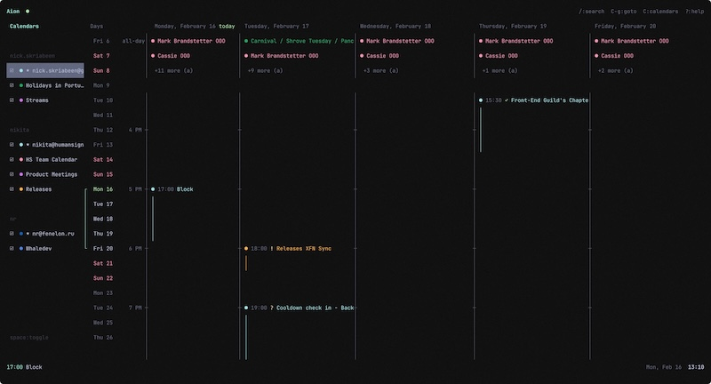

<p align="center">
  
</p>

<h1 align="center">Aion</h1>

<p align="center">
  <strong>Terminal calendar client with vim-style keybindings</strong><br>
  <em>Beautiful. Fast. Keyboard-driven.</em>
</p>



<p align="center">
  <a href="#quick-start">Quick Start</a> •
  <a href="#keybindings">Keybindings</a> •
  <a href="#commands">Commands</a> •
  <a href="#configuration">Configuration</a>
</p>

<p align="center">
  <a href="https://github.com/semos-labs/aion/releases/latest"></a>
  <a href="https://github.com/semos-labs/aion/releases/latest"></a>
  
  
</p>

---

## Table of Contents

- [Why Aion?](#why-aion)
- [Quick Start](#quick-start)
- [Keybindings](#keybindings)
  - [Navigation](#navigation)
  - [Events](#events)
  - [General](#general)
- [Commands](#commands)
- [Configuration](#configuration)
  - [Theme](#theme)
- [Data Storage](#data-storage)
- [Tech Stack](#tech-stack)
- [Roadmap](#roadmap)

---

## Why Aion?

Most calendar apps are mouse-driven, slow, and cluttered. Aion takes a different approach:

**Vim-style navigation. Terminal-native. Zero distractions.**

### Features

| Feature | Description |
|---------|-------------|
| **⌨️ Vim Keybindings** | Navigate with `j`/`k`, `gg`/`G`, `h`/`l` — feels like home |
| **📅 Visual Timeline** | Day view with 15-minute precision and overlap handling |
| **🔗 Google Calendar Sync** | Multi-account OAuth with PKCE, background sync every 30s |
| **👥 Meet With** | Find free slots across multiple people's calendars |
| **📹 Google Meet** | Auto-generate Meet links when creating events |
| **📁 Multi-Calendar** | Toggle calendars on/off, each with its own color |
| **🌍 Timezone Support** | Events display in local time, toggle to see original timezone |
| **🎨 Themeable** | Customize every color via TOML configuration |
| **💾 Local-First** | SQLite database, your data stays yours |
| **🔔 Notifications** | Track pending invites at a glance |
| **📝 Command Palette** | Quick access to all actions with fuzzy search |
| **🔍 Event Search** | Find events by title or description with `/` |
| **🗓️ Natural Language Dates** | Type "tomorrow 3pm" or "next friday for 2 hours" |
| **🔁 Recurring Events** | Create and edit events with daily/weekly/monthly/yearly recurrence |
| **❓ Context Help** | Press `?` anywhere to see available keybindings |
| **🚀 Fast** | Built with Bun and React — instant startup |

---

## Quick Start

### Option 1: Homebrew (macOS/Linux)

```bash
brew tap semos-labs/tap
brew install aion
```

### Option 2: Download Binary

Download the latest release for your platform from the [Releases](https://github.com/semos-labs/aion/releases) page:

| Platform | Binary |
|----------|--------|
| macOS (Apple Silicon) | `aion-darwin-arm64` |
| macOS (Intel) | `aion-darwin-x64` |
| Linux (x64) | `aion-linux-x64` |
| Linux (ARM64) | `aion-linux-arm64` |

```bash
# Make executable (macOS/Linux)
chmod +x aion-darwin-arm64

# Move to PATH
sudo mv aion-darwin-arm64 /usr/local/bin/aion

# Run
aion
```

### Option 3: Build from Source

```bash
git clone https://github.com/semos-labs/aion.git
cd aion
bun install

# Run in development
bun dev

# Build binary for current platform
bun run build

# Binary will be at ./dist/aion
```

### 2. Set Up Google Cloud Credentials

Aion requires your own Google Cloud credentials to access Google Calendar. Here's how to set them up:

#### Create a Google Cloud Project

1. Go to [Google Cloud Console](https://console.cloud.google.com)
2. Create a new project (or select an existing one)
3. Enable the **Google Calendar API**:
   - Go to "APIs & Services" → "Library"
   - Search for "Google Calendar API"
   - Click "Enable"

#### Create OAuth Credentials

1. Go to "APIs & Services" → "Credentials"
2. Click "Create Credentials" → "OAuth client ID"
3. If prompted, configure the OAuth consent screen:
   - User Type: **External** (or Internal for Workspace)
   - Add your email as a test user
   - Add the following scopes:
     - `https://www.googleapis.com/auth/calendar.events` (read/write events)
     - `https://www.googleapis.com/auth/calendar.readonly` (read calendars list)
     - `https://www.googleapis.com/auth/userinfo.email` (get user email)
     - `https://www.googleapis.com/auth/userinfo.profile` (get user name/picture)
4. Create OAuth client ID:
   - Application type: **Desktop app**
   - Name: "Aion" (or anything you like)
5. Copy the **Client ID** and **Client Secret**

#### Configure Aion

Add your credentials to `~/.config/aion/config.toml`:

```toml
[google]
clientId = "your-client-id.apps.googleusercontent.com"
clientSecret = "your-client-secret"
```

Or use environment variables:

```bash
export AION_GOOGLE_CLIENT_ID="your-client-id.apps.googleusercontent.com"
export AION_GOOGLE_CLIENT_SECRET="your-client-secret"
```

### 3. Run

```bash
bun dev
```

### 4. Connect Google Calendar

```
:login
```

Follow the OAuth flow in your browser. Aion supports multiple Google accounts.

### 5. Navigate

Use `j`/`k` to move through events, `h`/`l` to switch panes, `Enter` to view details.

---

## Keybindings

### Navigation

| Key | Action |
|-----|--------|
| `j` / `↓` | Move down / Next item |
| `k` / `↑` | Move up / Previous item |
| `h` / `←` | Previous day / column |
| `l` / `→` | Next day / column |
| `Tab` | Cycle focus between panes |
| `` ` `` | Cycle focus (Calendars → Days → Timeline) |
| `gg` | Jump to first item |
| `G` | Jump to last item |
| `n` | Jump to now (timeline only) |
| `Ctrl+G` | Go to date (natural language) |

### Events

| Key | Action |
|-----|--------|
| `Enter` / `Space` | Open event details |
| `e` | Edit event |
| `D` | Delete event |
| `Ctrl+N` | Create new event |
| `Ctrl+M` | Meet with... (find free slots) |

### Event Details

| Key | Action |
|-----|--------|
| `y` | Accept invitation |
| `n` | Decline invitation |
| `m` | Maybe / Tentative |
| `o` | Open meeting link (Meet, Zoom, Teams, etc.) |
| `e` | Edit event |
| `D` | Delete event |
| `t` | Toggle timezone (local ↔ original) |

### Calendars & Accounts

| Key | Action |
|-----|--------|
| `Shift+C` | Toggle calendars sidebar |
| `A` | Toggle all-day events section |

### View

| Key | Action |
|-----|--------|
| `3` | Toggle between 1 and 3 column view |
| `` ` `` | Cycle focus (Calendars → Days → Timeline) |

### General

| Key | Action |
|-----|--------|
| `/` | Search events |
| `:` | Open command palette |
| `?` | Show help (context-aware) |
| `N` | Open notifications |
| `Esc` | Close overlay / Go back |
| `q` | Quit |

---

## Commands

Open the command palette with `:` and type a command:

### Event Management

| Command | Action |
|---------|--------|
| `new` | Create new event |
| `new <title>` | Create event with title |
| `edit` | Edit selected event |
| `delete` | Delete selected event |

### Navigation

| Command | Action |
|---------|--------|
| `goto <date>` | Jump to date (e.g., `goto tomorrow`, `goto march 15`) |
| `now` | Jump to current time |
| `today` | Jump to today |

### Google Calendar

| Command | Action |
|---------|--------|
| `login` | Add Google account |
| `logout` | Remove all accounts |
| `sync` | Force sync with Google Calendar |
| `accounts` | Manage connected accounts |
| `calendars` | Toggle calendars sidebar |

### Scheduling

| Command | Action |
|---------|--------|
| `meet` | Find free slots with other people |

### Search

| Command | Action |
|---------|--------|
| `search` | Search events by title/description |

### View

| Command | Action |
|---------|--------|
| `columns <n>` | Set column count (1, 3, or 5) |

### General

| Command | Action |
|---------|--------|
| `help` | Show keybindings |
| `notifications` | Open notifications panel |
| `quit` | Exit application |

Navigate with `↑`/`↓` or `Ctrl+P`/`Ctrl+N`, auto-fill with `Ctrl+Y`, select with `Enter`.

---

## Natural Language Dates

When creating or editing events, you can use natural language for dates and times:

| Input | Result |
|-------|--------|
| `tomorrow 3pm` | Tomorrow at 3:00 PM |
| `next friday at 10am` | Next Friday at 10:00 AM |
| `in 2 hours` | 2 hours from now |
| `today at 5pm for 30 minutes` | Today 5:00-5:30 PM |
| `from march 5 for 2 weeks` | All-day event, March 5-19 |
| `between march 6 and 12` | All-day event, March 6-12 |

---

## Configuration

Create `~/.config/aion/config.toml` to customize Aion:

### Theme

```toml
[theme]
# Accent colors
[theme.accent]
primary = "cyan"
secondary = "blue"
success = "green"
warning = "yellow"
error = "red"

# Text colors
[theme.text]
primary = "white"
secondary = "gray"
dim = "darkGray"

# Selection highlight
[theme.selection]
background = "blue"
text = "white"
indicator = "cyan"

# Event type colors
[theme.eventType]
default = "cyan"
focusTime = "blue"
outOfOffice = "magenta"
birthday = "yellow"

# Attendance status colors
[theme.status]
accepted = "green"
declined = "red"
tentative = "yellow"

# UI elements
[theme.modal]
background = "black"

[theme.input]
background = "black"

[theme.statusBar]
background = "black"
```

---

## Data Storage

Aion supports two directory layouts:

### Legacy Layout (`~/.aion/`)

If `~/.aion/` exists, Aion uses it for backward compatibility. All files are stored in this single directory.

### XDG Layout (new installations)

New installations follow the [XDG Base Directory Specification](https://specifications.freedesktop.org/basedir-spec/basedir-spec-latest.html):

**Configuration** (`~/.config/aion/`):
| File | Description |
|------|-------------|
| `config.toml` | User configuration (Google credentials, theme) |
| `contacts.json` | Optional manual contacts for name lookup |

**Data** (`~/.local/share/aion/`):
| File | Description |
|------|-------------|
| `aion.db` | SQLite database with all events |
| `accounts.json` | OAuth tokens and account info |
| `calendar-settings.json` | Calendar visibility preferences |
| `account-settings.json` | Custom account names |
| `sync-tokens.json` | Incremental sync tokens |
| `logs/` | Application logs (daily rotation) |

You can override XDG paths with environment variables:
- `XDG_CONFIG_HOME` (default: `~/.config`)
- `XDG_DATA_HOME` (default: `~/.local/share`)

---

## Tech Stack

| Component | Technology |
|-----------|------------|
| **Runtime** | [Bun](https://bun.sh) |
| **UI Framework** | [Glyph](https://github.com/semos-labs/glyph) (React for terminals) |
| **State Management** | [Jotai](https://jotai.org) |
| **Database** | SQLite via [Drizzle ORM](https://orm.drizzle.team) |
| **Date/Time** | [Luxon](https://moment.github.io/luxon) |
| **NLP Dates** | [chrono-node](https://github.com/wanasit/chrono) |
| **Validation** | [Zod](https://zod.dev) |

---

## Roadmap

### ✅ Completed

- [x] Google Calendar sync (OAuth with PKCE)
- [x] Multi-account support
- [x] Multiple calendars per account
- [x] Calendar toggle sidebar
- [x] Meet With (free/busy scheduling)
- [x] Google Meet link generation
- [x] Natural language date input
- [x] Timezone handling
- [x] Background sync (30s interval)
- [x] Accounts management dialog
- [x] Recurring event creation/editing
- [x] Search events by title/description
- [x] Multi-column day view (1, 3, or 5 columns)
- [x] Column navigation with h/l arrows
- [x] Persistent view settings
- [x] Command auto-fill (Ctrl+Y)
- [x] Built-in credentials for distributed binaries
- [x] Homebrew distribution
- [x] XDG Base Directory support

### 🚧 In Progress

- [ ] Month view

### 📋 Planned

- [ ] Import/export (ICS)
- [ ] CalDAV support
- [ ] Offline mode improvements
- [ ] Custom notifications/reminders
- [ ] Agenda view (list of upcoming events)
- [ ] Event templates

---

## License

MIT © 2025

---

<p align="center">
  <sub>Built with ⌨️ for terminal lovers</sub>
</p>
